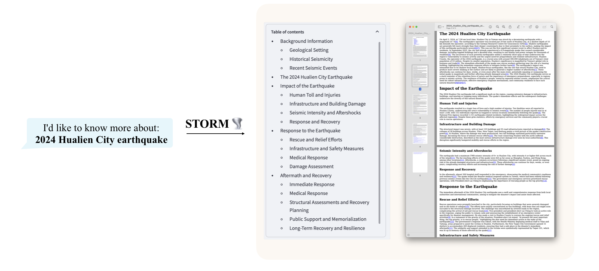

# STORM: Synthesis of Topic Outlines through Retrieval and Multi-perspective Question Asking

This repository contains the code for our NAACL 2024 paper [Assisting in Writing Wikipedia-like Articles From Scratch with Large Language Models](https://arxiv.org/abs/2402.14207) by [Yijia Shao](https://cs.stanford.edu/~shaoyj), [Yucheng Jiang](https://yucheng-jiang.github.io/), Theodore A. Kanell, Peter Xu, [Omar Khattab](https://omarkhattab.com/), and [Monica S. Lam](https://suif.stanford.edu/~lam/).

## Overview [(Try STORM now!)](https://storm.genie.stanford.edu/)
<p align="center">
  
</p>
STORM is a LLM system that writes Wikipedia-like articles from scratch based on Internet search.

While the system cannot produce publication-ready articles that often require a significant number of edits, experienced Wikipedia editors have found it helpful in their pre-writing stage.

**Try out our [live demo](https://storm.genie.stanford.edu/) to see how STORM can help your knowledge exploration journey and please provide feedback to help us improve the system 🙏!**

## Research Before Writing
STORM breaks down generating long articles with citations into two steps:
1. **Pre-writing stage**: The system conducts Internet-based research to collect references and generates an outline.
2. **Writing stage**: The system uses the outline and references to generate the full-length article with citations.
<p align="center">
  
</p>

STORM identifies the core of automating the research process as automatically coming up with good questions to ask. Directly prompting the language model to ask questions does not work well. To improve the depth and breadth of the questions, STORM adopts two strategies:
1. **Perspective-Guided Question Asking**: Given the input topic, STORM discovers different perspectives by surveying existing articles from similar topics and uses them to control the question-asking process.
2. **Simulated Conversation**: STORM simulates a conversation between a Wikipedia writer and a topic expert grounded in Internet sources to enable the language model to update its understanding of the topic and ask follow-up questions.

Based on the separation of the two stages, STORM is implemented in a highly modular way (see [engine.py](src/engine.py)) using [dspy](https://github.com/stanfordnlp/dspy).


## Setup

**We view STORM as an example of automated knowledge curation. We are working on enhancing our codebase to increase its extensibility. Stay tuned!**

Below, we provide a quick start guide to run STORM locally to reproduce our experiments.

1. Install the required packages.
   ```shell
   conda create -n storm python=3.9
   conda activate storm
   pip install -r requirements.txt
   ```
2. Set up OpenAI API key and [You.com search API](https://api.you.com/) key. Create a file `secrets.toml` under the root directory and add the following content:
    ```shell
    # Set up OpenAI API key.
    OPENAI_API_KEY=<your_openai_api_key>
    # If you are using the API service provided by OpenAI, include the following line:
    OPENAI_API_TYPE=openai
    # If you are using the API service provided by Microsoft Azure, include the following lines:
    OPENAI_API_TYPE=azure
    AZURE_API_BASE=<your_azure_api_base_url>
    AZURE_API_VERSION=<your_azure_api_version>
    # Set up You.com search API key.
    YOU_API_KEY=<your_youcom_api_key>
    ```

## Paper Experiments
The FreshWiki dataset used in our experiments can be found in [./FreshWiki](FreshWiki).

Run the following commands under [./src](src).

### Pre-writing Stage
For batch experiment on FreshWiki dataset:
```shell
python -m scripts.run_prewriting --input-source file --input-path ../FreshWiki/topic_list.csv  --engine gpt-4 --do-research --max-conv-turn 5 --max-perspective 5
```
- `--engine` (choices=[`gpt-4`, `gpt-35-turbo`]): the LLM engine used for generating the outline
- `--do-research`: if True, simulate conversation to research the topic; otherwise, load the results.
- `--max-conv-turn`: the maximum number of questions for each information-seeking conversation
- `--max-perspective`: the maximum number of perspectives to be considered, each perspective corresponds to an information-seeking conversation. 
  - STORM also uses a general conversation to collect basic information about the topic. So, the maximum number of QA pairs is `max_turn * (max_perspective + 1)`. :bulb: Reducing `max_turn` or `max_perspective` can speed up the process and reduce the cost but may result in less comprehensive outline.
  - The parameter will not have any effect if `--disable-perspective` is set (the perspective-driven question asking is disabled).

To run the experiment on a single topic:
```shell
python -m scripts.run_prewriting --input-source console --engine gpt-4 --max-conv-turn 5 --max-perspective 5
```
- The script will ask you to enter the `Topic` and the `Ground truth url` that will be excluded. If you do not have any url to exclude, leave that field empty.

The generated outline will be saved in `{output_dir}/{topic}/storm_gen_outline.txt` and the collected references will be saved in `{output_dir}/{topic}/raw_search_results.json`.


### Writing Stage
For batch experiment on FreshWiki dataset:
```shell
python -m scripts.run_writing --input-source file --input-path ../FreshWiki/topic_list.csv --engine gpt-4 --do-polish-article --remove-duplicate
```
- `--do-polish-article`: if True, polish the article by adding a summarization section and removing duplicate content if `--remove-duplicate` is set True.

To run the experiment on a single topic:
```shell
python -m scripts.run_writing --input-source console --engine gpt-4 --do-polish-article --remove-duplicate
````
- The script will ask you to enter the `Topic`. Please enter the same topic as the one used in the pre-writing stage.

The generated article will be saved in `{output_dir}/{topic}/storm_gen_article.txt` and the references corresponding to citation index will be saved in `{output_dir}/{topic}/url_to_info.json`. If `--do-polish-article` is set, the polished article will be saved in `{output_dir}/{topic}/storm_gen_article_polished.txt`. 

## Customize the STORM Configurations
We set up the default LLM configuration in `LLMConfigs` in [src/modules/utils.py](src/modules/utils.py). You can use `set_conv_simulator_lm()`,`set_question_asker_lm()`, `set_outline_gen_lm()`, `set_article_gen_lm()`, `set_article_polish_lm()` to override the default configuration. These functions take in an instance from `dspy.dsp.LM` or `dspy.dsp.HFModel`.

:bulb: **For a good practice,** 
- choose a cheaper/faster model for `conv_simulator_lm` which is used to split queries, synthesize answers in the conversation.
- if you need to conduct the actual writing step, choose a more powerful model for `article_gen_lm`. Based on our experiments, weak models are bad at generating text with citations.


## Automatic Evaluation

In our paper, we break down the evaluation into two parts: outline quality and full-length article quality.

### Outline Quality
We introduce *heading soft recall* and *heading entity recall* to evaluate the outline quality. This makes it easier to prototype methods for pre-writing.

Run the following command under [./eval](eval) to compute the metrics on FreshWiki dataset:
```shell
python eval_outline_quality.py --input-path ../FreshWiki/topic_list.csv --gt-dir ../FreshWiki --pred-dir ../results --pred-file-name storm_gen_outline.txt --result-output-path ../results/storm_outline_quality.csv
```

### Full-length Article Quality
[eval/eval_article_quality.py](eval/eval_article_quality.py) provides the entry point of evaluating full-length article quality using ROUGE, entity recall, and rubric grading. Run the following command under `eval` to compute the metrics:
```shell
python eval_article_quality.py --input-path ../FreshWiki/topic_list.csv --gt-dir ../FreshWiki --pred-dir ../results --gt-dir ../FreshWiki --output-dir ../results/storm_article_eval_results --pred-file-name storm_gen_article_polished.txt
```

### Use the Metric Yourself
The similarity-based metrics (i.e., ROUGE, entity recall, and heading entity recall) are implemented in [eval/metrics.py](eval/metrics.py).

For rubric grading, we use the [prometheus-13b-v1.0](https://huggingface.co/kaist-ai/prometheus-13b-v1.0) introduced in [this paper](https://arxiv.org/abs/2310.08491). [eval/evaluation_prometheus.py](eval/evaluation_prometheus.py) provides the entry point of using the metric.

## Contributions
If you have any questions or suggestions, please feel free to open an issue or pull request. We welcome contributions to improve the system and the codebase!

Contact person: [Yijia Shao](mailto:shaoyj@stanford.edu) and [Yucheng Jiang](mailto:yuchengj@stanford.edu)

## Citation
Please cite our paper if you use this code or part of it in your work:
```bibtex
@inproceedings{shao2024assisting,
      title={{Assisting in Writing Wikipedia-like Articles From Scratch with Large Language Models}}, 
      author={Yijia Shao and Yucheng Jiang and Theodore A. Kanell and Peter Xu and Omar Khattab and Monica S. Lam},
      year={2024},
      booktitle={Proceedings of the 2024 Conference of the North American Chapter of the Association for Computational Linguistics: Human Language Technologies, Volume 1 (Long and Short Papers)}
}
```

