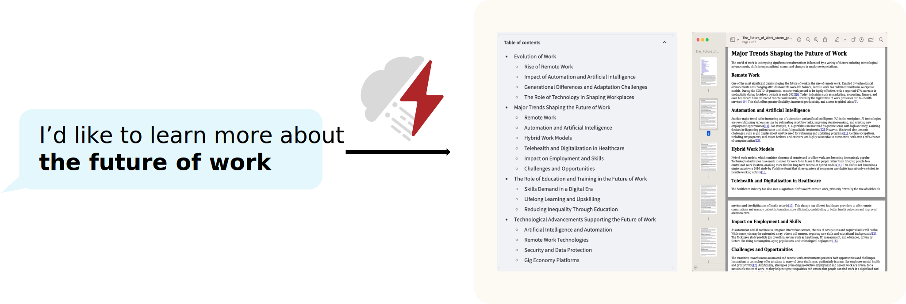
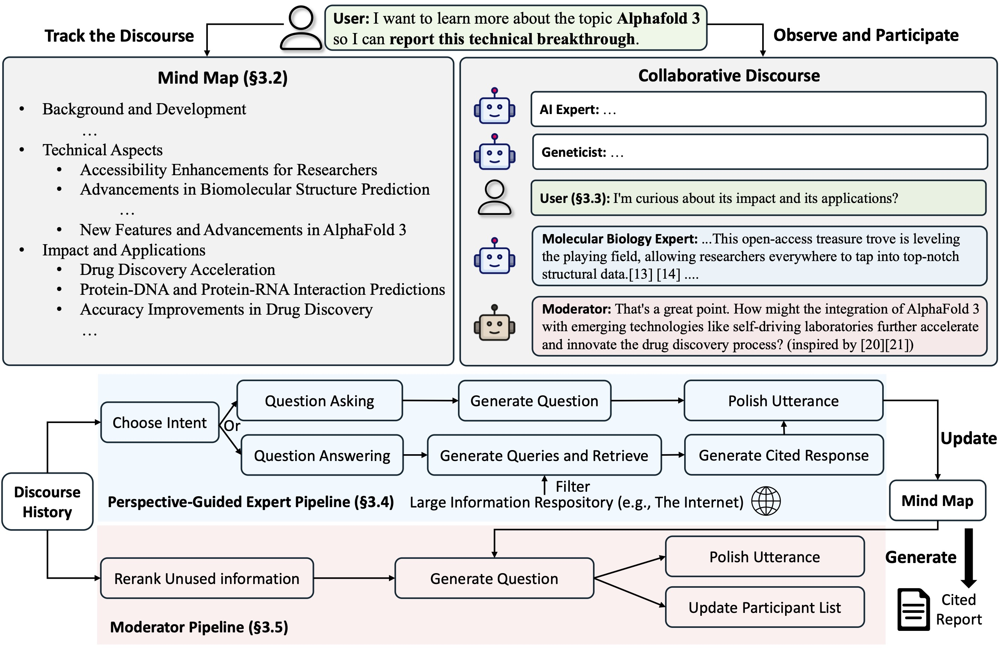

<p align="center">
  
</p>

# STORM: Synthesis of Topic Outlines through Retrieval and Multi-perspective Question Asking

<p align="center">
| <a href="http://storm.genie.stanford.edu"><b>Research preview</b></a> | <a href="https://arxiv.org/abs/2402.14207"><b>STORM Paper</b></a>| <a href="https://www.arxiv.org/abs/2408.15232"><b>Co-STORM Paper</b></a>  | <a href="https://storm-project.stanford.edu/"><b>Website</b></a> |
</p>

**Latest News** 🔥

- [2024/09] Co-STORM codebase is now released and integrated into `knowledge-storm` python package v1.0.0. Run `pip install knowledge-storm --upgrade` to check it out.

- [2024/09] We introduce collaborative STORM (Co-STORM) to support human-AI collaborative knowledge curation! [Co-STORM Paper](https://www.arxiv.org/abs/2408.15232) has been accepted to EMNLP 2024 main conference.

- [2024/07] You can now install our package with `pip install knowledge-storm`!
- [2024/07] We add `VectorRM` to support grounding on user-provided documents, complementing existing support of search engines (`YouRM`, `BingSearch`). (check out [#58](https://github.com/stanford-oval/storm/pull/58))
- [2024/07] We release demo light for developers a minimal user interface built with streamlit framework in Python, handy for local development and demo hosting (checkout [#54](https://github.com/stanford-oval/storm/pull/54))
- [2024/06] We will present STORM at NAACL 2024! Find us at Poster Session 2 on June 17 or check our [presentation material](assets/storm_naacl2024_slides.pdf). 
- [2024/05] We add Bing Search support in [rm.py](knowledge_storm/rm.py). Test STORM with `GPT-4o` - we now configure the article generation part in our demo using `GPT-4o` model.
- [2024/04] We release refactored version of STORM codebase! We define [interface](knowledge_storm/interface.py) for STORM pipeline and reimplement STORM-wiki (check out [`src/storm_wiki`](knowledge_storm/storm_wiki)) to demonstrate how to instantiate the pipeline. We provide API to support customization of different language models and retrieval/search integration.

[](https://github.com/psf/black)

## Overview [(Try STORM now!)](https://storm.genie.stanford.edu/)

<p align="center">
  
</p>
STORM is a LLM system that writes Wikipedia-like articles from scratch based on Internet search. Co-STORM further enhanced its feature by enabling human to collaborative LLM system to support more aligned and preferred information seeking and knowledge curation.

While the system cannot produce publication-ready articles that often require a significant number of edits, experienced Wikipedia editors have found it helpful in their pre-writing stage.

**More than 70,000 people have tried our [live research preview](https://storm.genie.stanford.edu/). Try it out to see how STORM can help your knowledge exploration journey and please provide feedback to help us improve the system 🙏!**


## How STORM & Co-STORM works

### STORM

STORM breaks down generating long articles with citations into two steps:

1. **Pre-writing stage**: The system conducts Internet-based research to collect references and generates an outline.
2. **Writing stage**: The system uses the outline and references to generate the full-length article with citations.
<p align="center">
  
</p>

STORM identifies the core of automating the research process as automatically coming up with good questions to ask. Directly prompting the language model to ask questions does not work well. To improve the depth and breadth of the questions, STORM adopts two strategies:
1. **Perspective-Guided Question Asking**: Given the input topic, STORM discovers different perspectives by surveying existing articles from similar topics and uses them to control the question-asking process.
2. **Simulated Conversation**: STORM simulates a conversation between a Wikipedia writer and a topic expert grounded in Internet sources to enable the language model to update its understanding of the topic and ask follow-up questions.

### CO-STORM

Co-STORM proposes **a collaborative discourse protocol** which implements a turn management policy to support smooth collaboration among 

- **Co-STORM LLM experts**: This type of agent generates answers grounded on external knowledge sources and/or raises follow-up questions based on the discourse history.
- **Moderator**: This agent generates thought-provoking questions inspired by information discovered by the retriever but not directly used in previous turns. Question generation can also be grounded!
- **Human user**: The human user will take the initiative to either (1) observe the discourse to gain deeper understanding of the topic, or (2) actively engage in the conversation by injecting utterances to steer the discussion focus.

<p align="center">
  
</p>

Co-STORM also maintains a dynamic updated **mind map**, which organize collected information into a hierarchical concept structure, aiming to **build a shared conceptual space between the human user and the system**. The mind map has been proven to help reduce the mental load when the discourse goes long and in-depth. 

Both STORM and Co-STORM are implemented in a highly modular way using [dspy](https://github.com/stanfordnlp/dspy).

## Installation


To install the knowledge storm library, use `pip install knowledge-storm`. 

You could also install the source code which allows you to modify the behavior of STORM engine directly.
1. Clone the git repository.
    ```shell
    git clone https://github.com/stanford-oval/storm.git
    cd storm
    ```
   
2. Install the required packages.
   ```shell
   conda create -n storm python=3.11
   conda activate storm
   pip install -r requirements.txt
   ```
   

## API

Currently, our package support:

- `OpenAIModel`, `AzureOpenAIModel`, `ClaudeModel`, `VLLMClient`, `TGIClient`, `TogetherClient`, `OllamaClient`, `GoogleModel`, `DeepSeekModel`, `GroqModel` as language model components
- `YouRM`, `BingSearch`, `VectorRM`, `SerperRM`, `BraveRM`, `SearXNG`, `DuckDuckGoSearchRM`, `TavilySearchRM`, `GoogleSearch`, and `AzureAISearch` as retrieval module components

:star2: **PRs for integrating more language models into [knowledge_storm/lm.py](knowledge_storm/lm.py) and search engines/retrievers into [knowledge_storm/rm.py](knowledge_storm/rm.py) are highly appreciated!**

Both STORM and Co-STORM are working in the information curation layer, you need to set up the information retrieval module and language model module to create their `Runner` classes respectively.

### STORM

The STORM knowledge curation engine is defined as a simple Python `STORMWikiRunner` class. Here is an example of using You.com search engine and OpenAI models.

```python
import os
from knowledge_storm import STORMWikiRunnerArguments, STORMWikiRunner, STORMWikiLMConfigs
from knowledge_storm.lm import OpenAIModel
from knowledge_storm.rm import YouRM

lm_configs = STORMWikiLMConfigs()
openai_kwargs = {
    'api_key': os.getenv("OPENAI_API_KEY"),
    'temperature': 1.0,
    'top_p': 0.9,
}
# STORM is a LM system so different components can be powered by different models to reach a good balance between cost and quality.
# For a good practice, choose a cheaper/faster model for `conv_simulator_lm` which is used to split queries, synthesize answers in the conversation.
# Choose a more powerful model for `article_gen_lm` to generate verifiable text with citations.
gpt_35 = OpenAIModel(model='gpt-3.5-turbo', max_tokens=500, **openai_kwargs)
gpt_4 = OpenAIModel(model='gpt-4o', max_tokens=3000, **openai_kwargs)
lm_configs.set_conv_simulator_lm(gpt_35)
lm_configs.set_question_asker_lm(gpt_35)
lm_configs.set_outline_gen_lm(gpt_4)
lm_configs.set_article_gen_lm(gpt_4)
lm_configs.set_article_polish_lm(gpt_4)
# Check out the STORMWikiRunnerArguments class for more configurations.
engine_args = STORMWikiRunnerArguments(...)
rm = YouRM(ydc_api_key=os.getenv('YDC_API_KEY'), k=engine_args.search_top_k)
runner = STORMWikiRunner(engine_args, lm_configs, rm)
```

The `STORMWikiRunner` instance can be evoked with the simple `run` method:
```python
topic = input('Topic: ')
runner.run(
    topic=topic,
    do_research=True,
    do_generate_outline=True,
    do_generate_article=True,
    do_polish_article=True,
)
runner.post_run()
runner.summary()
```
- `do_research`: if True, simulate conversations with difference perspectives to collect information about the topic; otherwise, load the results.
- `do_generate_outline`: if True, generate an outline for the topic; otherwise, load the results.
- `do_generate_article`: if True, generate an article for the topic based on the outline and the collected information; otherwise, load the results.
- `do_polish_article`: if True, polish the article by adding a summarization section and (optionally) removing duplicate content; otherwise, load the results.

### Co-STORM

The Co-STORM knowledge curation engine is defined as a simple Python `CoStormRunner` class. Here is an example of using Bing search engine and OpenAI models.

```python
from knowledge_storm.collaborative_storm.engine import CollaborativeStormLMConfigs, RunnerArgument, CoStormRunner
from knowledge_storm.lm import OpenAIModel
from knowledge_storm.logging_wrapper import LoggingWrapper
from knowledge_storm.rm import BingSearch

# Co-STORM adopts the same multi LM system paradigm as STORM 
lm_config: CollaborativeStormLMConfigs = CollaborativeStormLMConfigs()
openai_kwargs = {
    "api_key": os.getenv("OPENAI_API_KEY"),
    "api_provider": "openai",
    "temperature": 1.0,
    "top_p": 0.9,
    "api_base": None,
} 
question_answering_lm = OpenAIModel(model=gpt_4o_model_name, max_tokens=1000, **openai_kwargs)
discourse_manage_lm = OpenAIModel(model=gpt_4o_model_name, max_tokens=500, **openai_kwargs)
utterance_polishing_lm = OpenAIModel(model=gpt_4o_model_name, max_tokens=2000, **openai_kwargs)
warmstart_outline_gen_lm = OpenAIModel(model=gpt_4o_model_name, max_tokens=500, **openai_kwargs)
question_asking_lm = OpenAIModel(model=gpt_4o_model_name, max_tokens=300, **openai_kwargs)
knowledge_base_lm = OpenAIModel(model=gpt_4o_model_name, max_tokens=1000, **openai_kwargs)

lm_config.set_question_answering_lm(question_answering_lm)
lm_config.set_discourse_manage_lm(discourse_manage_lm)
lm_config.set_utterance_polishing_lm(utterance_polishing_lm)
lm_config.set_warmstart_outline_gen_lm(warmstart_outline_gen_lm)
lm_config.set_question_asking_lm(question_asking_lm)
lm_config.set_knowledge_base_lm(knowledge_base_lm)

# Check out the Co-STORM's RunnerArguments class for more configurations.
topic = input('Topic: ')
runner_argument = RunnerArgument(topic=topic, ...)
logging_wrapper = LoggingWrapper(lm_config)
bing_rm = BingSearch(bing_search_api_key=os.environ.get("BING_SEARCH_API_KEY"),
                     k=runner_argument.retrieve_top_k)
costorm_runner = CoStormRunner(lm_config=lm_config,
                               runner_argument=runner_argument,
                               logging_wrapper=logging_wrapper,
                               rm=bing_rm)
```

The `CoStormRunner` instance can be evoked with the `warmstart()` and `step(...)` methods.

```python
# Warm start the system to build shared conceptual space between Co-STORM and users
costorm_runner.warm_start()

# Step through the collaborative discourse 
# Run either of the code snippets below in any order, as many times as you'd like
# To observe the conversation:
conv_turn = costorm_runner.step()
# To inject your utterance to actively steer the conversation:
costorm_runner.step(user_utterance="YOUR UTTERANCE HERE")

# Generate report based on the collaborative discourse
costorm_runner.knowledge_base.reorganize()
article = costorm_runner.generate_report()
print(article)
```


## Quick Start with Example Scripts

We provide scripts in our [examples folder](examples) as a quick start to run STORM and Co-STORM with different configurations.

We suggest using `secrets.toml` to set up the API keys. Create a file `secrets.toml` under the root directory and add the following content:

```shell
# Set up OpenAI API key.
OPENAI_API_KEY="your_openai_api_key"
# If you are using the API service provided by OpenAI, include the following line:
OPENAI_API_TYPE="openai"
# If you are using the API service provided by Microsoft Azure, include the following lines:
OPENAI_API_TYPE="azure"
AZURE_API_BASE="your_azure_api_base_url"
AZURE_API_VERSION="your_azure_api_version"
# Set up You.com search API key.
YDC_API_KEY="your_youcom_api_key"
```

for **Co-STORM**, please also add following
```
# if use openai encoder
ENCODER_API_TYPE="openai"
# or ENCODER_API_TYPE="azure" if use azure openai encoder
```

### STORM examples

**To run STORM with `gpt` family models with default configurations:**

Run the following command.
```bash
python examples/storm_examples/run_storm_wiki_gpt.py \
    --output-dir $OUTPUT_DIR \
    --retriever you \
    --do-research \
    --do-generate-outline \
    --do-generate-article \
    --do-polish-article
```

**To run STORM using your favorite language models or grounding on your own corpus:** Check out [examples/storm_examples/README.md](examples/storm_examples/README.md).

### Co-STORM examples

To run Co-STORM with `gpt` family models with default configurations,

1. Add `BING_SEARCH_API_KEY="xxx"` and `ENCODER_API_TYPE="xxx"` to `secrets.toml`
2. Run the following command

```bash
python examples/costorm_examples/run_costorm_gpt.py \
    --output-dir $OUTPUT_DIR \
    --retriever bing
```


## Customization of the Pipeline

### STORM

If you have installed the source code, you can customize STORM based on your own use case. STORM engine consists of 4 modules:

1. Knowledge Curation Module: Collects a broad coverage of information about the given topic.
2. Outline Generation Module: Organizes the collected information by generating a hierarchical outline for the curated knowledge.
3. Article Generation Module: Populates the generated outline with the collected information.
4. Article Polishing Module: Refines and enhances the written article for better presentation.

The interface for each module is defined in `knowledge_storm/interface.py`, while their implementations are instantiated in `knowledge_storm/storm_wiki/modules/*`. These modules can be customized according to your specific requirements (e.g., generating sections in bullet point format instead of full paragraphs).

### Co-STORM

If you have installed the source code, you can customize Co-STORM based on your own use case

1. Co-STORM introduces multiple LLM agent types (i.e. Co-STORM experts and Moderator). LLM agent interface is defined in `knowledge_storm/interface.py` , while its implementation is instantiated in `knowledge_storm/collaborative_storm/modules/co_storm_agents.py`. Different LLM agent policies can be customized.
2. Co-STORM introduces a collaborative discourse protocol, with its core function centered on turn policy management. We provide an example implementation of turn policy management through `DiscourseManager` in `knowledge_storm/collaborative_storm/engine.py`. It can be customized and further improved.

## Datasets
To facilitate the study of automatic knowledge curation and complex information seeking, our project releases the following datasets:

### FreshWiki
The FreshWiki Dataset is a collection of 100 high-quality Wikipedia articles focusing on the most-edited pages from February 2022 to September 2023. See Section 2.1 in [STORM paper](https://arxiv.org/abs/2402.14207) for more details.

You can download the dataset from [huggingface](https://huggingface.co/datasets/EchoShao8899/FreshWiki) directly. To ease the data contamination issue, we archive the [source code](https://github.com/stanford-oval/storm/tree/NAACL-2024-code-backup/FreshWiki) for the data construction pipeline that can be repeated at future dates.

### WildSeek
To study users’ interests in complex information seeking tasks in the wild, we utilized data collected from the web research preview to create the WildSeek dataset. We downsampled the data to ensure the diversity of the topics and the quality of the data. Each data point is a pair comprising a topic and the user’s goal for conducting deep search on the topic.  For more details, please refer to Section 2.2 and Appendix A of [Co-STORM paper](https://www.arxiv.org/abs/2408.15232).

The WildSeek dataset is available [here](https://huggingface.co/datasets/YuchengJiang/WildSeek).

## Replicate STORM & Co-STORM paper result

For STORM paper experiments, please switch to the branch `NAACL-2024-code-backup` [here](https://github.com/stanford-oval/storm/tree/NAACL-2024-code-backup).

For Co-STORM paper experiments, please switch to the branch `EMNLP-2024-code-backup` (placeholder for now, will be updated soon).

## Roadmap & Contributions
Our team is actively working on:
1. Human-in-the-Loop Functionalities: Supporting user participation in the knowledge curation process.
2. Information Abstraction: Developing abstractions for curated information to support presentation formats beyond the Wikipedia-style report.

If you have any questions or suggestions, please feel free to open an issue or pull request. We welcome contributions to improve the system and the codebase!

Contact person: [Yijia Shao](mailto:shaoyj@stanford.edu) and [Yucheng Jiang](mailto:yuchengj@stanford.edu)

## Acknowledgement
We would like to thank Wikipedia for its excellent open-source content. The FreshWiki dataset is sourced from Wikipedia, licensed under the Creative Commons Attribution-ShareAlike (CC BY-SA) license.

We are very grateful to [Michelle Lam](https://michelle123lam.github.io/) for designing the logo for this project and [Dekun Ma](https://dekun.me) for leading the UI development.

## Citation
Please cite our paper if you use this code or part of it in your work:
```bibtex
@misc{jiang2024unknownunknowns,
      title={Into the Unknown Unknowns: Engaged Human Learning through Participation in Language Model Agent Conversations}, 
      author={Yucheng Jiang and Yijia Shao and Dekun Ma and Sina J. Semnani and Monica S. Lam},
      year={2024},
      eprint={2408.15232},
      archivePrefix={arXiv},
      primaryClass={cs.CL},
      url={https://arxiv.org/abs/2408.15232}, 
}

@inproceedings{shao2024assisting,
      title={{Assisting in Writing Wikipedia-like Articles From Scratch with Large Language Models}}, 
      author={Yijia Shao and Yucheng Jiang and Theodore A. Kanell and Peter Xu and Omar Khattab and Monica S. Lam},
      year={2024},
      booktitle={Proceedings of the 2024 Conference of the North American Chapter of the Association for Computational Linguistics: Human Language Technologies, Volume 1 (Long and Short Papers)}
}
```
