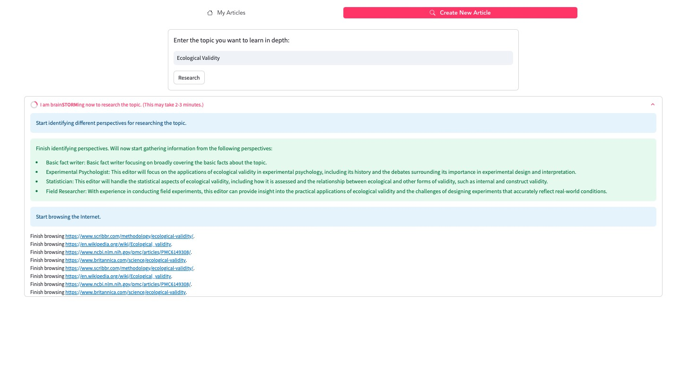
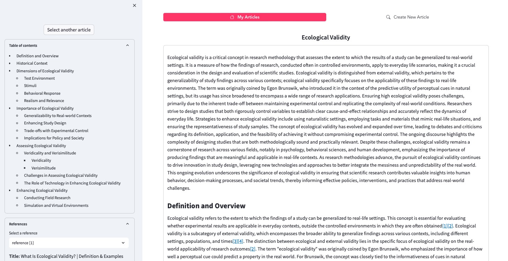

# STORM Minimal User Interface

This is a minimal user interface for `STORMWikiRunner` which includes the following features:
1. Allowing user to create a new article through the "Create New Article" page.
2. Showing the intermediate steps of STORMWikiRunner in real-time when creating an article.
3. Displaying the written article and references side by side.
4. Allowing user to view previously created articles through the "My Articles" page.

<p align="center">
  
</p>

<p align="center">
  
</p>

## Setup
1. Make sure you have installed `knowledge-storm` or set up the source code correctly.
2. Install additional packages required by the user interface:
    ```bash
    pip install -r requirements.txt
    ```
2. Make sure you set up the API keys following the instructions in the main README file. Create a copy of `secrets.toml` and place it under `.streamlit/`.
3. Run the following command to start the user interface:
    ```bash
    streamlit run storm.py
    ```
   The user interface will create a `DEMO_WORKING_DIR` directory in the current directory to store the outputs.

## Customization

You can customize the `STORMWikiRunner` powering the user interface according to [the guidelines](https://github.com/stanford-oval/storm?tab=readme-ov-file#customize-storm) in the main README file.

The `STORMWikiRunner` is initialized in `set_storm_runner()` in [demo_util.py](demo_util.py). You can change `STORMWikiRunnerArguments`, `STORMWikiLMConfigs`, or use a different retrieval model according to your need.
