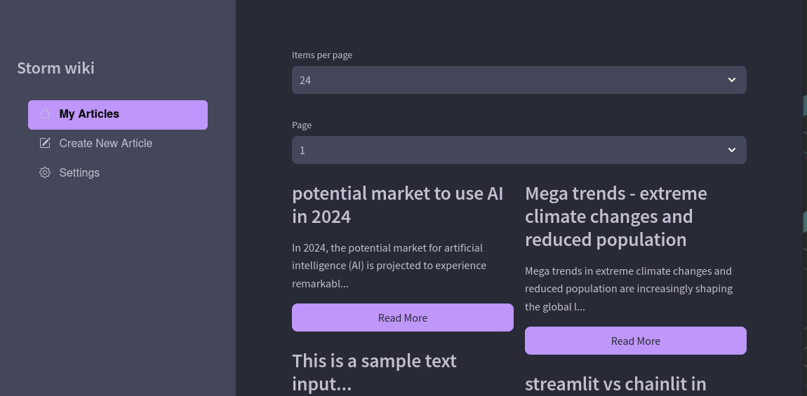
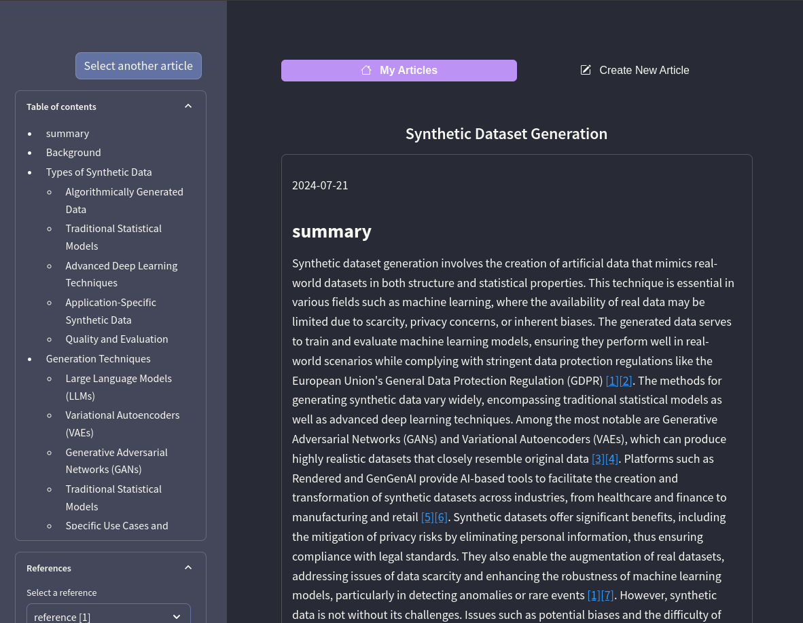
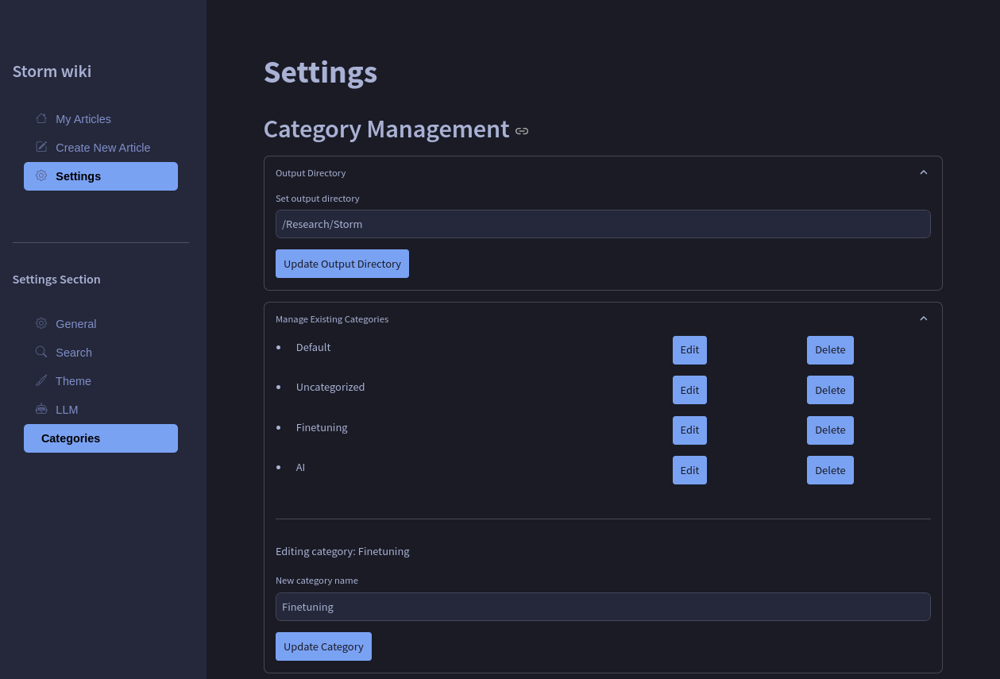
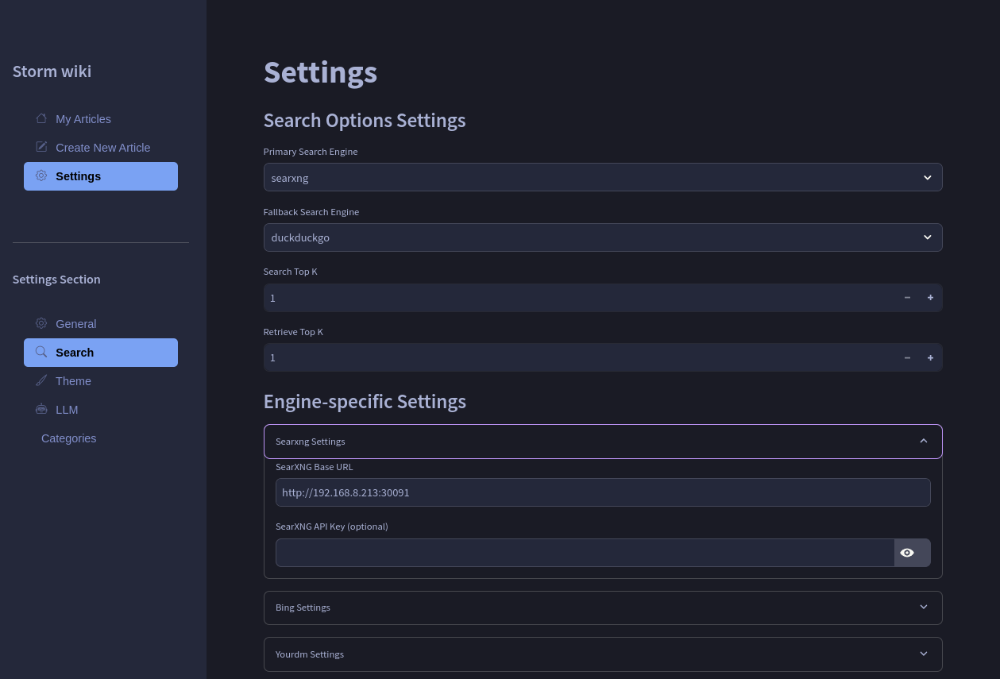
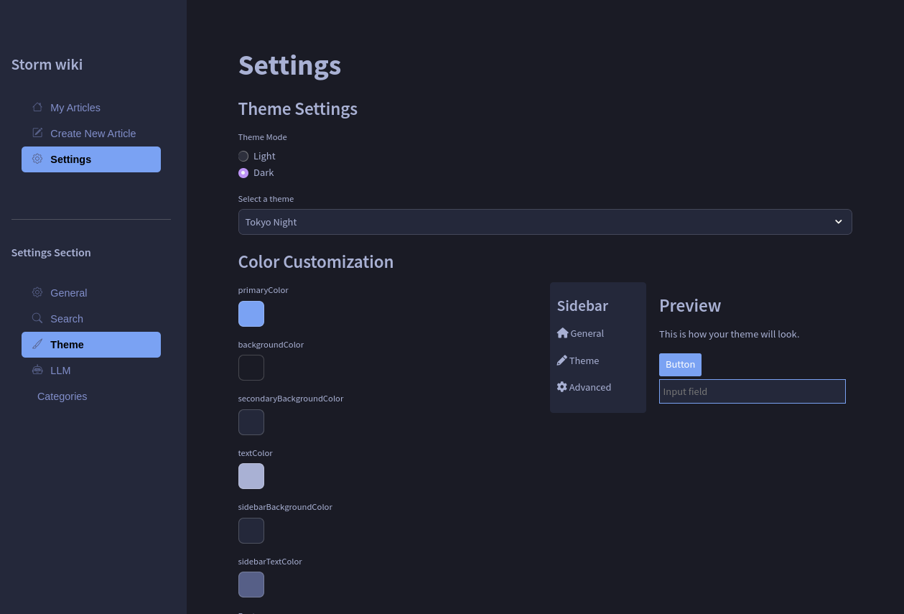

# STORM wiki

[STORM](https://github.com/stanford-oval/storm) frontend modified.

## Features & Changes

- dotenv for env vars
- save result files as '*.md'
- add date to to top of the result file
- added STORM_TIMEZONE
- configure dark and light theme colors
- configure arize-phoenix in settings
- configure searxng and other search engines in settings



<details><summary>screenshots</summary>

article



creating new article with search and llm fallback options


add categories



configure search engines



dark and light themes



</details>

## Prerequisites

- Docker and Docker Compose
- Required API keys (see main STORM repository)

## Installation and Usage with Docker

1. Clone the repository:
   ```sh
   git clone https://github.com/jaigouk/storm_wiki.git
   cd storm_wiki
   ```

2. Set up environment variables:
   ```sh
   cp .env.example .env
   # Edit .env with your preferred text editor to set the required variables
   ```

3. Set up Streamlit secrets:
   ```sh
   cp secrets.toml.example secrets.toml
   # Edit secrets.toml with your preferred text editor to set the required secrets
   ```

4. Build and run the Docker container:
   ```sh
   docker compose up --build
   ```

   This command will build the Docker image and start the container. The app will be available at `http://localhost:8501` (or the port you specified in the .env file). If you want to use specific directory then change `STREAMLIT_OUTPUT_DIR`.

5. To stop the container:
   ```sh
   docker compose down
   ```

## Configuration

After starting the app, you can configure various settings through the UI:

1. Configure search engines:
   - Visit the settings menu and click Search settings
   - Add necessary values. Note: Bing and You search are currently not usable, but you can use searxng, arxiv, duckduckgo
   - Choose primary and fallback search engines

2. Configure LLM:
   - Visit the LLM menu and choose primary and fallback LLM
   - For ollama, you will see the localhost LLM list. Choose them with max tokens
   - You can set a fallback LLM like OpenAI's gpt-4o-mini

3. Categories setting:
   - Choose output directory (root directory for category folders)
   - Edit and delete existing categories
   - Create new category folders

## Customization

To customize STORMWikiRunner settings, modify `set_storm_runner()` in `demo_util.py`. Refer to the [main STORM repository](https://github.com/stanford-oval/storm) for detailed customization options.

## Development

If you want to run the app locally for development:

1. Install Python 3.10+
2. Install dependencies:
   ```sh
   pip install -r requirements.txt
   ```
3. Run the Streamlit app:
   ```sh
   streamlit run storm.py --server.port 8501 --server.address 0.0.0.0
   ```

## Troubleshooting

If you encounter any issues with the Docker setup, ensure that:
- Docker and Docker Compose are installed and up to date
- The required ports are not being used by other applications
- Your .env and secrets.toml files are properly configured

For more detailed logs, you can run:
```sh
docker compose up --build --log-level DEBUG
```
